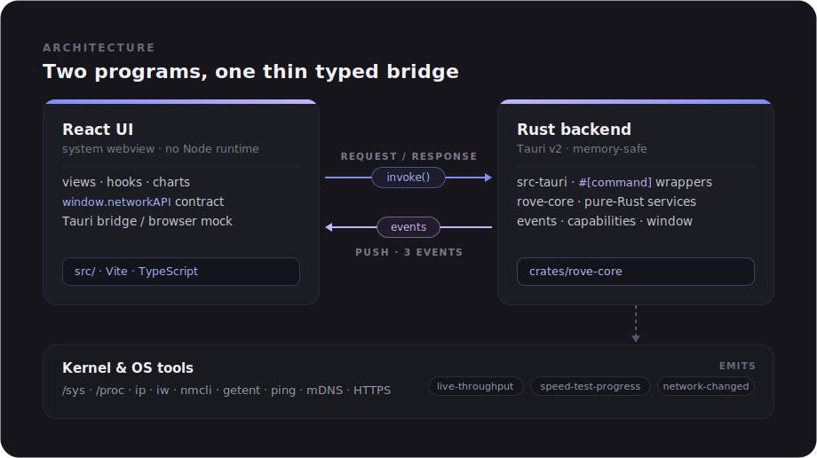
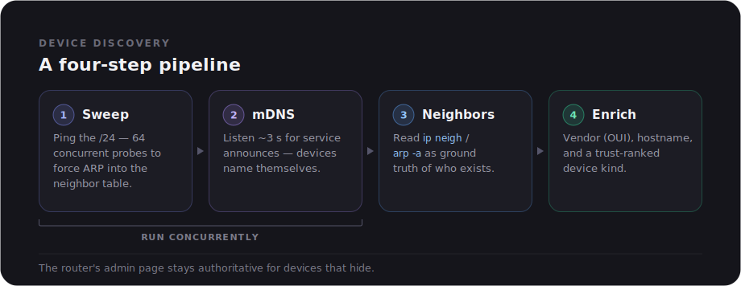

<div align="center">


# Rove

**A fast, minimal desktop network monitor.**

Live traffic · speed tests · LAN device discovery · connection diagnostics · data-usage tracking

<p>
  
  
  
  
</p>

</div>

---

## How it works

Rove is two programs talking over a thin, typed bridge:

<div align="center">
  
</div>

- **Request/response.** Each UI data need is one Tauri *command* (`get_network_info`,
  `get_devices`, `run_speed_test`, …), a thin wrapper in `src-tauri/src/lib.rs`
  around a pure-Rust service in `crates/rove-core`.
- **Push** — three *events* flow the other way: `live-throughput` (1 Hz while the
  Home tab is subscribed), `speed-test-progress`, and `network-changed` (the
  backend watches `ip monitor route` and nudges the UI within ~1 s of a cable
  pull or Wi-Fi join, so state never waits on the 15 s poll).
- **The contract** — TypeScript types in `src/types/` define every payload; the
  Rust structs in `crates/rove-core/src/types.rs` mirror them field-for-field
  (serde renames everything to camelCase on the wire). The UI never knows it's
  talking to Rust: `src/bridge/tauriNetworkApi.ts` implements the same
  `window.networkAPI` interface that a browser mock (`src/dev/`) also implements,
  which is why `npm run dev` works in a plain browser for UI work.

### What each feature actually measures

**Connection card / network info.** The kernel routing table is the source of
truth: `ip route show default` names the interface your traffic really uses
(so LAN↔Wi-Fi switches are always right), then per-medium tools fill in the
detail: `iw`/`nmcli` for SSID, band, channel, signal; `ethtool`/sysfs for link
speed and duplex. DNS comes from `resolv.conf`.

**Live traffic.** A 1 Hz sampler reads the kernel's cumulative per-interface
byte counters (via `sysinfo`), converts deltas to Mbps, smooths them with an
exponential moving average, and emits an event. Virtual interfaces (docker,
veth, vpn…) are excluded.

**Devices.** A four-step pipeline (`crates/rove-core/src/devices/`):

<div align="center">
  
</div>

1. *Sweep* — ping every host in your /24 (64 concurrent probes). The point is
   not the ICMP reply but the ARP exchange it forces: idle devices enter the
   kernel neighbor table even if they block ping.
2. *mDNS*: concurrently, listen ~3 s for service announcements (`_googlecast`,
   `_ipp`, `_hap`, `_raop`, …). Devices literally say what they are, often with
   a friendly name and hardware model.
3. *Neighbor table*: `ip neigh` (or `arp -a`) is then read as the ground truth
   of who exists.
4. *Enrich & classify*: each host gets a vendor (MAC OUI table), a hostname
   (reverse DNS/mDNS, junk names filtered), and a best-effort kind. Signals are
   ranked by trust: role flags → mDNS service type → mDNS hardware model →
   hostname patterns → vendor patterns → weak mDNS hints → "unknown".
   A device that blocks ping *and* announces nothing can still hide; the
   router's admin page stays authoritative.

**Speed test.** Saturates the link ~6 s per direction: parallel HTTPS streams
from public test endpoints (download) and random-payload POSTs (upload), then
10 pings to 1.1.1.1 for latency/jitter/loss. Progress streams as events; a
cancel command aborts between and within phases (streams poll a shared flag).
Results feed the capability ratings (can this connection do 4K, cloud gaming…)
against per-activity thresholds. Fair warning: at multi-gigabit rates one test
moves 1–2 GB. That's inherent to how throughput measurement works.

**Data usage.** Every 30 s the backend accumulates counter deltas into per-day
buckets persisted in the app-data dir (survives restarts; counters themselves
reset at boot, which the delta logic handles). The "since boot" totals shown in
the UI are read straight from `/sys/class/net/*/statistics` at query time:
kernel truth, no bookkeeping.

**Diagnostics.** Pings your default gateway (latency / jitter / packet loss)
and lists the DNS servers in use.

### Security model

Tauri v2 is deny-by-default: the webview can only call what
`src-tauri/capabilities/default.json` grants (our commands, event listening,
and the frameless-window controls). There is no Node runtime in the UI process
and the backend is memory-safe Rust.

## Layout

```
rove/
├── src/                        React UI (Vite)
│   ├── main.tsx, App.tsx       entry + shell (header, nav, view switching)
│   ├── views/                  one file per page: Home, Interfaces, Devices,
│   │                           Usage, Diagnostics
│   ├── components/
│   │   ├── ui/                 app-agnostic chrome: Section, DataRow, Subpage,
│   │   │                       TabBar, Icons (lucide re-exports)
│   │   ├── connection/         connection card + display helpers
│   │   ├── traffic/            live throughput panel, chart, readouts
│   │   ├── speed-test/         speed test section + history (+ storage)
│   │   └── capabilities/       capability list, details, meter, icon, rating
│   ├── hooks/                  data hooks over window.networkAPI
│   │                           (useBackendResource is the shared fetch shape)
│   ├── lib/                    generic helpers (format, chart geometry)
│   ├── types/                  the UI↔backend contract (mirrored in Rust)
│   ├── bridge/                 Tauri implementation of the contract
│   ├── navigation/             tab definitions
│   └── dev/                    browser mock bridge (npm run dev without Tauri)
├── crates/rove-core/         all platform services in pure Rust (no Tauri/GTK
│                               deps — compiles and tests anywhere): network_info,
│                               interfaces, devices/, diagnostics, speed, mdns,
│                               live_throughput, data_usage, oui, shell
└── src-tauri/                  thin Tauri shell: one #[tauri::command] per
                                service, events, capabilities, window config
```

## Development

One-time system deps (Linux):

```bash
sudo apt install -y build-essential libwebkit2gtk-4.1-dev libgtk-3-dev \
  librsvg2-dev libayatana-appindicator3-dev
# Rust, if missing: https://rustup.rs
```

Then:

```bash
npm install
npm run tauri:dev            # run the desktop app (hot-reloads the UI)
npm run dev                  # UI only, in a browser, against the mock bridge
cargo check -p rove-core   # typecheck the service layer alone
cargo run -p rove-core --example scan   # print a live LAN scan
```

> **Dev note (Linux/snap):** if you launch from a snap-packaged terminal (e.g.
> VS Code from snap), unset its library path first or the binary picks up
> snap's glibc and crashes at startup:
> `env -u LD_LIBRARY_PATH -u GTK_PATH npm run tauri:dev`

## Release build

```bash
npm run tauri:build   # .deb ~5 MB, AppImage, dmg (macOS), nsis (Windows)
```

## Platform support

All services run on Linux, macOS and Windows. Each looks for the native tool
for the job and degrades gracefully (missing values render as “—”):

| | Linux | macOS | Windows |
|---|---|---|---|
| Default route / interface | `ip route` | `route -n get` | `Get-NetRoute` |
| Wi-Fi details | `nmcli`, `iw` | CoreWLAN, `system_profiler` | `netsh wlan` |
| Link speed | `ethtool`, sysfs | CoreWLAN (Wi-Fi) | `Get-NetAdapter` |
| DNS servers | `resolv.conf` | `resolv.conf` | `Get-DnsClientServerAddress` |
| Neighbor table | `ip neigh` | `arp -a` | `arp -a` |
| Reverse hostnames | `getent` | `dscacheutil` | `System.Net.Dns` |
| Interface state | sysfs | `ifconfig` | `Get-NetAdapter` |
| mDNS, sweep, speed test, throughput, usage | pure Rust everywhere | ✓ | ✓ |

Platform branches are runtime `cfg!()` checks, so every path typechecks on
every OS; CI (`.github/workflows/build.yml`) builds all three bundles. The
instant network-change monitor (`ip monitor route`) is Linux-only; macOS and
Windows fall back to the 15 s poll.

On macOS 14.4+ the private `airport` tool was gutted (it now only prints a
deprecation notice), so Rove reads Wi-Fi in-process via CoreWLAN — including the
link-speed / transmit rate, which the shell tools no longer expose. The SSID
sits behind Location Services, so Rove asks for that permission once at startup;
without it the network name shows as “—” while everything else still resolves.
