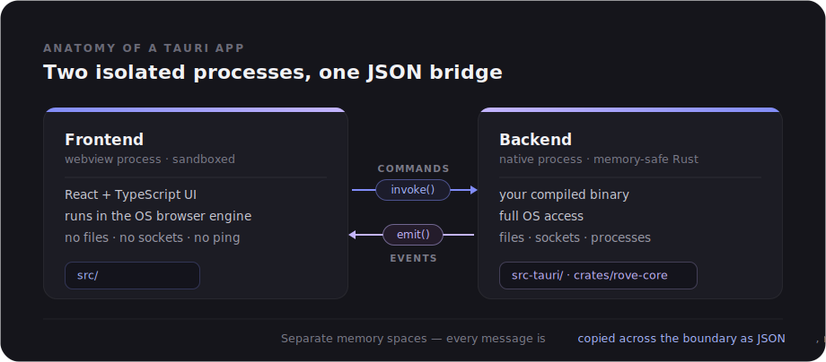

# Learning Rust & Tauri through Rove

A guided tour of Rust and Tauri using Rove's own source code as the textbook.
Every concept points at real code in this repo, with file/line references you can
click through in your editor.

> **Companion pages:**
> - [How Rove Captures Network Data (per OS)](./networking-data-capture.md) — a
>   deep dive into the per-OS probes (`ip`/`netsh`/CoreWLAN, byte counters) that
>   feed everything below.
> - [How Rove Discovers & Identifies LAN Devices](./device-discovery.md) — the
>   full device-scan pipeline: the ARP-table trick, TCP/mDNS probing, OUI vendor
>   lookup, and the weighted-vote classifier.

---

## 1. The shape of a Tauri app

A Tauri app is two worlds glued together:

<div align="center">
  
</div>

The frontend is literally a web page. It can't open a socket or read `/sys`.
When it needs something native, it **invokes a command** — sends a JSON message
across the IPC bridge to a Rust function, which does the real work and returns
JSON. That's the entire mental model. Electron does the same thing but ships a
whole Chromium + Node; Tauri uses the OS's built-in webview and a Rust core, so
the binary is tiny.

Rove splits the Rust side into **two crates** (a "crate" = a Rust compilation
unit / library or binary):

- `crates/rove-core/` — pure logic. The doc comment on line 1 says it:
  *"Pure Rust (no Tauri/GTK dependency) so it compiles and tests anywhere."*
  This is where the actual network measuring lives.
- `src-tauri/` — the "thin Tauri shell." Line 1: *"each command maps 1:1 to a
  service."*

That separation is a deliberate architecture lesson: keep your real logic free
of framework dependencies so you can unit-test it and reason about it in
isolation. The Tauri layer just wires it to the UI.

---

## 2. What IPC actually is

**IPC = Inter-Process Communication.** It's the general term for any mechanism
that lets two *separate running programs* (processes) exchange data. They don't
share memory — each process has its own isolated address space, protected by the
operating system — so they can't just read each other's variables. They have to
pass **messages** through a channel the OS provides: pipes, sockets, shared
memory regions, etc.

### Why Rove needs IPC at all

A Tauri app is not one program — it's (at least) **two processes**:

1. The **webview process** — the OS's browser engine (WebKit on macOS/Linux,
   WebView2/Edge on Windows) running your React UI. It's sandboxed: no file
   access, no sockets, no ability to run a ping.
2. The **Rust process** — your native binary with full OS access.

They are genuinely separate processes with separate memory. So when your React
code needs the public IP, it *cannot* call the Rust function directly — the
function lives in a different process's memory that the webview can't see. The
only way across the boundary is to send a message. That message-passing is the
IPC.

### The channel Tauri uses

Tauri hides the plumbing behind two directions of message flow:

- **Frontend → Backend: commands.** The JS calls
  `invoke("get_public_ip", { args })`. Tauri serializes the call (command name +
  arguments) into JSON, ships it across the IPC channel, and on the Rust side
  deserializes it, finds the matching `#[tauri::command]` function, runs it, then
  serializes the return value back as JSON. `invoke` returns a `Promise`, so from
  JS it feels like a normal async function call — the process boundary and the
  JSON round-trip are invisible.

- **Backend → Frontend: events.** Rust can push messages the other way *without*
  being asked, using `app.emit("event-name", payload)`. The frontend subscribes
  with `listen("event-name", handler)`. Rove uses this for anything streaming
  or unsolicited: `speed-test-progress` (progress bar updates during a speed
  test), `live-throughput` (a sample every second), and `network-changed`
  (fired the instant a cable is pulled). See `src-tauri/src/lib.rs` —
  `run_speed_test` emits progress at line 168-170, and `spawn_throughput_broadcaster`
  emits at line 362.

### Why everything must be JSON-serializable

Because the data is *copied across a process boundary as text*, both sides only
ever exchange things that can be turned into JSON and back. This is exactly why:

- Every type a command returns derives `Serialize` (see `crates/rove-core/src/types.rs`).
- Command errors are converted to `String` (`.map_err(|e| e.to_string())`) — a
  rich Rust error type can't cross the wire, but a string can.
- The Rust structs use `#[serde(rename_all = "camelCase")]` so the JSON keys
  match what the TypeScript side expects.

You never share a pointer or a live object between the two sides — only values,
copied as JSON. Keeping that picture in your head explains most of Tauri's API
design.

### The mental model in one line

> The webview and the Rust core are two isolated processes. IPC is the postal
> service between them: commands are letters you send and wait for a reply to;
> events are letters the backend sends you unprompted. Every letter is written
> in JSON.

---

## 3. Your first Rust function, line by line

Look at `get_public_ip` in `src-tauri/src/lib.rs:144` — the smallest complete
command:

```rust
#[tauri::command]
async fn get_public_ip() -> Option<String> {
    rove_core::network_info::public_ip().await
}
```

Five things to unpack, each a core Rust idea:

**`#[tauri::command]`** — an *attribute macro*. It's code that generates code at
compile time. This one wraps your function so Tauri can call it from JavaScript:
it generates the glue to deserialize the incoming JSON arguments, call your
function, and serialize the return value back. You write a plain Rust function;
the macro makes it callable from the frontend. In JS this becomes
`await invoke("get_public_ip")`.

**`async fn` … `.await`** — asynchronous code. Fetching a public IP means a
network round-trip that takes time. `async` means "this function can pause while
waiting instead of blocking the thread." `.await` is where it actually pauses.
Rust's async is *zero-cost*: no garbage collector, no green-thread runtime baked
into the language — you bring your own runtime (Tauri bundles **tokio**).
For now: `async`/`await` = "do slow I/O without freezing."

**`-> Option<String>`** — the return type, and your first taste of Rust's most
important idea: **making absence explicit in the type system.** There's no `null`
in Rust. A value that might not exist is an `Option<T>`, which is *either*:

- `Some(value)` — it's here
- `None` — it's not

You physically cannot forget to handle the `None` case, because the compiler
won't let you touch the inner `String` without first unwrapping the `Option`.
`get_public_ip` returns `Option<String>` because you might be offline — no IP
available. The "billion-dollar mistake" (null pointer bugs) is designed out of
the language.

---

## 4. `Result` — the other half of "no exceptions"

Rust has no exceptions either. Operations that can *fail* return a
**`Result<T, E>`**: either `Ok(value)` or `Err(error)`. Look at
`get_speed_history` in `src-tauri/src/lib.rs:206`:

```rust
#[tauri::command]
fn get_speed_history(store: tauri::State<'_, Arc<Store>>) -> Result<Vec<SpeedHistoryRecord>, String> {
    store.speed_history().map_err(|e| e.to_string())
}
```

- `Result<Vec<SpeedHistoryRecord>, String>` = "on success, a vector (growable
  array) of records; on failure, a String error message."
- `store.speed_history()` returns a `Result` whose error type is some
  database-error type.
- `.map_err(|e| e.to_string())` transforms *just the error case*: if it failed,
  convert the DB error into a plain `String`. (`|e| ...` is a closure — an inline
  anonymous function, like JS `e => ...`.) Why? Because errors crossing to
  JavaScript must be serializable, and a `String` always is.

When a Tauri command returns `Result`, the frontend's `invoke()` promise
**resolves** on `Ok` and **rejects** on `Err`. So Rust's `Result` maps cleanly
onto a JS `try/catch`. That's the whole error story: `Option` for "might be
absent," `Result` for "might fail." No hidden control flow.

The `?` operator is the payoff. See `import_speed_history` at
`src-tauri/src/lib.rs:219`:

```rust
for entry in &entries {
    store.insert_speed(entry).map_err(|e| e.to_string())?;   // ← the ?
}
Ok(())
```

`?` means: "if this is `Err`, return that error from the whole function right
now; otherwise unwrap the `Ok` and keep going." It's early-return-on-error in one
character. It's why Rust error handling doesn't drown in `if err != nil`
boilerplate.

---

## 5. Ownership — the concept that makes Rust *Rust*

This is the big one, and `crates/rove-core/src/data_usage.rs` shows it
beautifully. Rust has **no garbage collector** and yet is memory-safe. How?
Three rules enforced at compile time:

1. Every value has exactly one **owner** (a variable).
2. When the owner goes out of scope, the value is freed — automatically,
   deterministically.
3. You can lend out **references** (`&`) to a value, but the compiler tracks them
   so a reference can never outlive the thing it points to (no dangling
   pointers, ever).

Watch the `&` in `summary` (`data_usage.rs:172`):

```rust
pub fn summary(&self, networks: &sysinfo::Networks) -> DataUsageSummary {
```

- `&self` — this method **borrows** the `UsageTracker` (read-only). It can look
  at the tracker but doesn't own or consume it, so the caller keeps using it
  afterward.
- `&sysinfo::Networks` — same: it *borrows* the network data to read from it. The
  caller (`get_data_usage` in `lib.rs:192`) still owns it.

Now contrast `sample` (`data_usage.rs:109`):

```rust
pub fn sample(&mut self, networks: &sysinfo::Networks) {
```

`&mut self` — a **mutable** borrow. `sample` needs to *change* the tracker
(update `last_bytes`). Rust's core safety rule: you can have **many readers XOR
one writer**, never both at once. That single rule, checked at compile time,
eliminates entire categories of bugs — data races, use-after-free, iterator
invalidation — with zero runtime cost. This is the thing people mean when they
say "if it compiles, it works."

One more, line 126:

```rust
self.last_bytes.insert(name.clone(), ByteCounts { rx, tx });
```

Why `name.clone()`? `name` is a *borrowed* `&String` from the loop. The HashMap
needs to **own** its keys (it outlives the loop). You can't stuff a borrow into
something that outlives it — the compiler forbids it. So you `.clone()` to make an
owned copy the map can keep. `.clone()` is always explicit in Rust — copies never
happen silently, so you always know where you're paying for one.

---

## 6. Structs, `impl`, and the `derive` shorthand

Rust isn't object-oriented, but it has **structs** (data) and **`impl` blocks**
(methods on that data). `UsageTracker` (`data_usage.rs:92`):

```rust
pub struct UsageTracker {
    store: Arc<Store>,
    last_bytes: HashMap<String, ByteCounts>,
    first_sample_recorded: bool,
}

impl UsageTracker {
    pub fn new(store: Arc<Store>) -> Self { ... }   // constructor by convention
    pub fn sample(&mut self, ...) { ... }            // method (takes &mut self)
    pub fn summary(&self, ...) -> ... { ... }        // method (takes &self)
}
```

`new` is just a convention (not a keyword) for a constructor. `Self` means "this
type." Methods that take `self`/`&self`/`&mut self` are called with dot syntax
(`tracker.sample(...)`); functions without `self` are "associated functions"
called with `::` (`UsageTracker::new(...)`).

Now the magic line you'll see *everywhere* in `types.rs:5`:

```rust
#[derive(Debug, Clone, Serialize, Deserialize, Default)]
#[serde(rename_all = "camelCase")]
pub struct ConnectionDetails { ... }
```

`#[derive(...)]` auto-generates trait implementations so you don't hand-write
them. A **trait** is like an interface — a set of behaviors a type can implement.
Here:

- `Debug` → printable for debugging (`{:?}`)
- `Clone` → gets a `.clone()` method
- `Serialize`/`Deserialize` → **this is the Tauri bridge.** These come from
  **serde**, Rust's serialization library. `Serialize` means "this struct can
  turn into JSON" — which is *exactly* how it crosses to the frontend. Every type
  a command returns must be `Serialize`.
- `#[serde(rename_all = "camelCase")]` → Rust convention is `snake_case`
  (`signal_strength`), but JS wants `camelCase` (`signalStrength`). This attribute
  renames every field during serialization so the existing React code consumes
  them unchanged.

So the full data path is: Rust struct → `derive(Serialize)` → serde turns it to
JSON → IPC bridge → TypeScript object in your React component. The types on both
sides are kept in sync by hand (that's what `types.rs` mirrors).

---

## 7. Shared state & fearless concurrency

Rove runs background loops (sampling usage every 30s, broadcasting throughput
every 1s) *and* handles commands — all touching shared state. In most languages
that's a minefield. Rust makes the danger visible in the types. Look at
`AppState` (`src-tauri/src/lib.rs:16`):

```rust
struct AppState {
    speed_cancel: Mutex<Option<Arc<AtomicBool>>>,
    usage: Mutex<Option<UsageTracker>>,
    networks: Mutex<sysinfo::Networks>,
    throughput_active: AtomicBool,
    ...
}
```

Three concurrency primitives, each teaching something:

- **`Arc<T>`** = "Atomically Reference-Counted" — a shared-ownership pointer.
  Remember rule 1 (one owner)? `Arc` is the escape hatch when *many* places need
  to share the same value: it keeps a thread-safe count and frees the value when
  the last `Arc` drops. That's why `Store` is wrapped in `Arc` — both the usage
  tracker and the command handlers hold a handle to the *same* database.

- **`Mutex<T>`** — a lock. To touch the data inside, you must `.lock()` it first,
  which hands you a guard; only the guard lets you reach the value, and when the
  guard drops, the lock releases. Rust ties "holding the lock" to "having the
  guard," so you *cannot* forget to unlock or accidentally read the data without
  locking. The type system enforces the discipline.

- **`AtomicBool`** — a single bool you can flip from any thread without a lock,
  used for simple flags like `throughput_active`.

There's a lovely real-world detail at `lock()` (`src-tauri/src/lib.rs:34`):

```rust
fn lock<T>(m: &Mutex<T>) -> std::sync::MutexGuard<'_, T> {
    m.lock().unwrap_or_else(|poisoned| poisoned.into_inner())
}
```

If a thread panics *while holding* a Mutex, Rust marks it "poisoned" — a signal
that the protected data might be in a half-updated state. The default `.lock()`
returns an `Err` in that case. This helper says "recover the data anyway instead
of crashing every future caller." This is idiomatic Rust: the type forces you to
confront the poisoned case, and you make a deliberate choice.

---

## 8. The full IPC round-trip, traced through Rove

Now let's follow real data across the process boundary, both directions, using
Rove's actual files.

### The bridge indirection (an architecture lesson)

Notice that Rove's React components **never call `invoke` directly.** They call
`window.networkAPI.getDataUsage()`. That `window.networkAPI` object is installed
at startup by `src/bridge/tauriNetworkApi.ts` (`installTauriBridge`), and it's the
*only* file that imports `invoke`. Why the indirection? Because there's a second
implementation, `src/dev/mockNetworkApi.ts`, used when the UI runs in a plain
browser (no Rust backend). The components are written against an interface
(`NetworkAPI`); at runtime either the real Tauri bridge or the mock is slotted in.
This is the same "program to an interface" idea as `rove-core` staying
Tauri-free — swappable implementations behind a stable boundary.

### Direction A — a command (request → reply)

Trace `get_data_usage`, the Home screen's usage numbers:

1. **React** wants data, calls `window.networkAPI.getDataUsage()`.
2. **Bridge** (`tauriNetworkApi.ts:48`): `() => invoke<DataUsageSummary>('get_data_usage')`.
   `invoke` is from `@tauri-apps/api/core`. The `<DataUsageSummary>` is just a
   TypeScript type annotation for *your* benefit — it does nothing at runtime; it
   promises the compiler that whatever comes back is shaped like that type.
3. **`invoke` serializes the call** — command name `"get_data_usage"` plus an args
   object (empty here) — into a message and hands it to the webview's IPC channel
   (Tauri exposes it on `window.__TAURI_INTERNALS__`). This crosses the *process
   boundary*. It returns a `Promise` immediately.
4. **Rust receives it.** Back in `src-tauri/src/lib.rs:640`, the
   `tauri::generate_handler![...]` macro built a dispatcher at compile time: it
   takes the incoming command name string and routes `"get_data_usage"` to your
   `get_data_usage` function.
5. **The function runs** (`lib.rs:192`):

   ```rust
   #[tauri::command]
   fn get_data_usage(state: tauri::State<'_, AppState>) -> DataUsageSummary {
   ```

   Note: `state: tauri::State<AppState>` was **not** sent from JavaScript — the JS
   call passed no arguments. Tauri recognizes certain "special" parameter types
   (`State`, `AppHandle`, `Window`) and **injects them on the Rust side** from the
   app's managed state. Only *ordinary* parameters are read from the JSON args.
   (That's why `saveSpeedResult(entry)` in the bridge passes `{ entry }`, and the
   Rust fn declares `entry: SpeedHistoryRecord` — the JSON key must match the
   parameter name.)
6. **The return value is serialized.** `DataUsageSummary` derives `Serialize`, so
   serde turns it into JSON, and Tauri sends it back across the boundary.
7. **The Promise resolves** with that JSON, now typed as `DataUsageSummary` on the
   JS side. If the command had returned `Result::Err`, the Promise would **reject**
   instead — caught by the `try/catch` in `useBackendResource.ts:63`.
8. **React re-renders** with the new data.

That's the whole loop: JS call → serialize → cross boundary → dispatch → run →
serialize → cross back → resolve Promise → re-render.

### Direction B — an event (backend pushes, unprompted)

Live throughput isn't something the UI asks for repeatedly — Rust *pushes* a
sample every second. Trace `live-throughput`:

1. **Rust loop** (`spawn_throughput_broadcaster`, `lib.rs:342`) wakes every second
   and calls:

   ```rust
   let _ = handle.emit("live-throughput", &sample);
   ```

   `emit` serializes `sample` (a `LiveThroughput`, which derives `Serialize`) and
   broadcasts it to the webview as a named event. The `let _ =` deliberately
   ignores the `Result` — if the UI window is gone, a failed emit is harmless.
2. **JS is listening.** In the bridge, `onLiveThroughput` (`tauriNetworkApi.ts:63`)
   calls `subscribeEvent('live-throughput', callback)`, which uses `listen` from
   `@tauri-apps/api/event` to register a handler for that event name.
3. **Each emit fires the callback** with the deserialized payload, which flows into
   `useLiveThroughput.ts` → `setState` → the chart re-renders.

### The two directions combined

Live throughput actually uses **both** directions together, which is a nice
pattern to internalize:

- A **command** turns the tap on/off: `subscribe_live_throughput` /
  `unsubscribe_live_throughput` (`lib.rs:240-248`) just flip an `AtomicBool`. The
  Rust loop only emits while that flag is true (`lib.rs:349`).
- The **event** stream (`live-throughput`) is the water flowing through the tap.

So: commands are for "do this / give me that, and reply"; events are for a
continuous or unsolicited stream. The subscribe command is the request to *start*
the stream; the stream itself arrives as events. Rove's `useLiveThroughput` hook
even reference-counts the subscribe command (`backendRefCount`, line 53) so that N
React consumers share one backend subscription — the first attach turns the tap on,
the last detach turns it off.

---

## 9. Async & tokio — the background loops

Sections 1–8 covered code that runs *when the UI asks*. But Rove also runs work
*on its own*: sampling usage every 30 s, broadcasting throughput every second,
watching for cable pulls. These are **long-lived async tasks**, and Tauri bundles
**tokio** to run them.

`tauri::async_runtime::spawn(future)` hands a future to tokio's scheduler — think
`std::thread::spawn`, but the tasks are cheap green tasks multiplexed onto a small
thread pool, not one OS thread each. `spawn_usage_sampler` (`lib.rs:319`) is the
simplest shape:

```rust
tauri::async_runtime::spawn(async move {
    loop {
        // ... take a sample ...
        tokio::time::sleep(Duration::from_secs(30)).await;
    }
});
```

The `.await` on `sleep` is the crucial bit: it **yields** the thread back to the
runtime for 30 s instead of blocking it, so one thread can host all three loops at
once. `async move` means the closure *takes ownership* of everything it captures
(here, the `AppHandle`) — required, because the task outlives the function that
spawned it, so it can't borrow.

Two production details are worth internalizing:

- **Panic isolation.** The sample tick is wrapped in `catch_unwind`
  (`lib.rs:324`). A panic inside one 30 s tick is logged and swallowed, so a single
  bad reading can't kill the loop and silently stop usage tracking for the rest of
  the session. The loop is a *supervisor*.
- **The tap pattern (command + event, combined).** `spawn_throughput_broadcaster`
  (`lib.rs:342`) wakes every second but only emits while an `AtomicBool` flag is
  set (`lib.rs:349`) — the flag the `subscribe_live_throughput` command flips. On
  the first tick after (re)subscribing it calls `sampler.prime()` and *skips one
  emit* (`lib.rs:357`), so the idle gap since the last subscription isn't reported
  as a single giant Mbps spike. That's the whole "commands turn the stream on;
  events are the stream" idea from Section 8, in ten lines.

The `speed-test-progress` stream (Section 8's Direction B, but request-scoped
rather than a standing loop) works the same way: `run_speed_test` (`lib.rs:149`)
hands the speed engine a closure that emits an event per progress update
(`lib.rs:168`), so the progress bar fills live while the `await` is still pending.

---

## 10. Traits & generics — one monitor, two operating systems

Rust reaches for **generics** the way other languages reach for interfaces or
duck typing — but resolved at *compile time*, with zero runtime cost. The route
monitor is a clean real example. Linux watches `ip monitor route`; Windows blocks
on a long-lived PowerShell. Both do the *same thing* — spawn a child process,
read one line per network change, debounce it into a `network-changed` event, and
respawn the child (with backoff) if it dies. Only *how you spawn the child*
differs.

So the shared logic is written once, generic over "a thing that makes a command":

```rust
async fn monitor_connectivity<F>(handle: tauri::AppHandle, spawn: F)
where
    F: Fn() -> tokio::process::Command,
{ ... }
```

`<F>` declares a type parameter; the `where F: Fn() -> tokio::process::Command`
clause **bounds** it — `F` can be any type, as long as it's a closure (or fn) that
takes nothing and returns a `Command`. The two callers pass different closures
(`lib.rs:376` and `383`), one building an `ip` command, the other a `powershell`
one. Rust **monomorphizes**: it stamps out a specialized copy of
`monitor_connectivity` for each concrete `F` at compile time, so there's no
dynamic dispatch and no boxing — the closure is inlined as if you'd hand-written
two functions. The `#[cfg(target_os = "…")]` attributes mean only the arm for the
platform you're building even compiles.

The body is a small lesson in resilient systems code (`lib.rs:416-453`): it reads
lines with `tokio::io::BufReader`, debounces bursts (`>= 800 ms` between emits so a
flurry of route changes collapses to one UI nudge), sets `kill_on_drop(true)` so
the child can't be orphaned when the app exits, and on child death respawns with
**exponential backoff** — a monitor that stayed up a minute resets the backoff to
1 s; rapid crashes double it up to a 30 s cap, so a permanently broken monitor
degrades to occasional retries instead of a busy-loop.

### The other kind of generic: `derive`

Section 6 showed `#[derive(Serialize)]`. That's the *same* trait machinery from
the other side: `Serialize` is a trait, and `#[derive]` auto-generates the
`impl Serialize for ConnectionDetails { … }` you'd otherwise hand-write. When
serde's `to_string` is called on your struct, the compiler already knows — again
at compile time, monomorphized — exactly how to walk its fields. Traits are the
one idea behind both "write logic once over many types" (generics) and "many types
share one behaviour" (`derive`, trait objects).

---

## 11. Ownership & borrowing — read the moves in real code

Section 5 gave the rules. Here are four one-liners from the files above; try to
predict *why each is written the way it is* before reading the answer.

1. **`cancel.clone()`** in `run_speed_test` (`lib.rs:168`). `cancel` is an
   `Arc<AtomicBool>`. It's cloned because *two* owners now need it: the closure
   passed into the speed engine (which polls it to abort mid-stream) and the slot
   stored in `AppState` (so `cancel_speed_test` can flip it from another command).
   Cloning an `Arc` doesn't copy the bool — it bumps a reference count and hands
   back a second handle to the *same* flag. That's how two async tasks share one
   cancellation signal safely.

2. **`async move`** in every `spawn` (`lib.rs:320`). Without `move`, the closure
   would *borrow* the `AppHandle` from the enclosing function — but the spawned
   task outlives that function, so the borrow would dangle. `move` transfers
   ownership into the task. The compiler *requires* it here; it won't let you spawn
   a task that borrows a local.

3. **`slot.take()`** in `cancel_speed_test` (`lib.rs:186`). `slot` is a
   `MutexGuard<Option<Arc<…>>>`. `.take()` moves the `Some(arc)` *out*, leaving
   `None` behind, so you own the `Arc` and can flip its flag — all without cloning,
   because you're consuming the stored value, not sharing it.

4. **`Arc::ptr_eq(c, &cancel)`** in `run_speed_test` (`lib.rs:177`). After a run
   finishes it clears its own cancel slot — but *only if a newer run hasn't already
   replaced it*. `ptr_eq` compares the two `Arc`s by pointer identity (same
   allocation?), not by value, which is exactly the "is this still *my* flag"
   question. A textbook case of borrowing (`&cancel`) to *inspect* without
   consuming.

The through-line: in Rust you can usually tell a value's lifetime story just by
reading `clone` / `move` / `&` / `take` at the call site. Nothing is copied or
shared implicitly.

---

## 12. Build & run it — add a command end-to-end

The real test of the mental model: add a new piece of data to the UI. Every
command in Rove is the same six edits, following the contract from Sections 6–8.
Say you want to surface the machine's uptime:

1. **Write the pure logic** in `crates/rove-core/` — a plain
   `pub async fn uptime_secs() -> Option<u64>`. No Tauri, no `#[command]`; it's
   unit-testable on its own (`cargo test -p rove-core`).
2. **Wrap it** in `src-tauri/src/lib.rs` with a thin command:

   ```rust
   #[tauri::command]
   async fn get_uptime() -> Option<u64> {
       rove_core::uptime_secs().await
   }
   ```
3. **Register it** in the `tauri::generate_handler![…]` list (`lib.rs:640`) so the
   compile-time dispatcher can route `"get_uptime"` to it. Forgetting this step is
   the classic "command not found" error.
4. **Declare the type** in `src/types/` and add the method to the `NetworkAPI`
   interface — the contract both bridge implementations must satisfy.
5. **Implement the bridge** in `src/bridge/tauriNetworkApi.ts`
   (`() => invoke<number | null>('get_uptime')`) *and* mirror it in
   `src/dev/mockNetworkApi.ts` so `npm run dev` keeps working in a plain browser.
6. **Consume it** from a hook via `useBackendResource` and render it in a view.

Notice what *doesn't* change: the IPC plumbing, the serialization, the event
system. The architecture from this whole doc — pure core, thin Tauri shell, typed
contract, swappable bridge — is exactly what makes step 1 the only place real
thought goes, and steps 2–6 mechanical.

```bash
npm run tauri:dev            # build + run the desktop app, hot-reloading the UI
cargo test -p rove-core      # test the pure logic in isolation
```

---

That's the full tour — IPC, ownership, `Option`/`Result`, structs/traits/derive,
async and tokio, generics, shared-state concurrency, and the complete round-trip
across the process boundary, every concept anchored in code you can open and
run. The companion pages go deeper on the two richest subsystems: the
[per-OS data capture](./networking-data-capture.md) and the
[device-discovery pipeline](./device-discovery.md).
